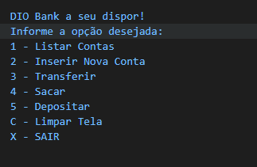

# Módulo Criando uma aplicação de transferências bancárias com .NET da [DIO](https://digitalinnovation.one)

Foi criado uma aplicação que para simular as operações bancárias de criar e listar contas, transferir entre contas e efetuar saques/depósitos. As contas são armazenadas em uma List.

